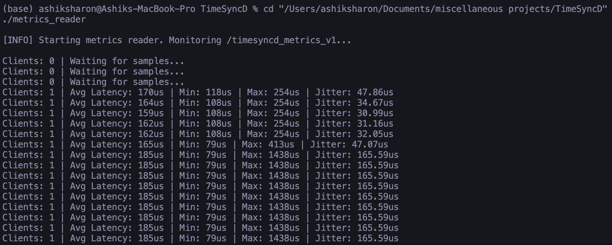
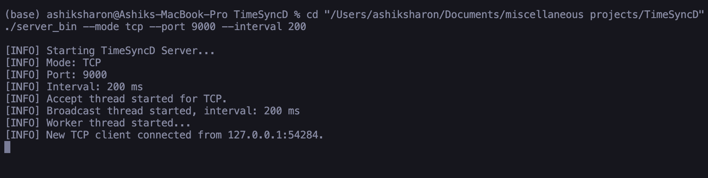
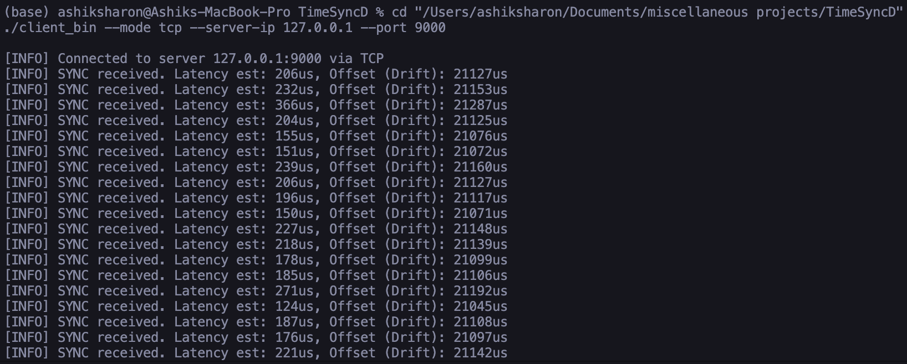

# TimeSyncD: Distributed Timing & Synchronization Engine

TimeSyncD is a production-quality C-based Linux application designed to simulate distributed clock synchronization and dynamically measure critical timing characteristics—such as latency, jitter, and drift—across multiple network clients.

Inspired by real-world synchronization structures like NTP and PTP, TimeSyncD reflects core systems programming methodologies including robust multi-threading, synchronous/asynchronous POSIX networking, algorithm precision, and Inter-Process Communication (IPC).

## Features

- **Multi-threaded Server Architecture**: Effectively maintains decoupled accepting threads, broadcaster threads, and response aggregation workers. 
- **Protocol Flexibility**: Operates synchronously via TCP (connection-oriented) or asynchronously via UDP (connectionless).
- **Latency & Jitter Aggregation**: Computes standard performance measurements, evaluating exact network jitter using Welford's online algorithm. 
- **POSIX Shared Memory (IPC)**: Relies on `shm_open` for storing internal metrics safely evaluated by isolated reader executables.
- **Client Drift Simulation**: Introduces isolated time-skew to test local offset capabilities precisely.

## Quick Start & Build

Requires a POSIX-compliant system (ideally Linux), `gcc`, and `make`.

```bash
# 1. Build the suite
make 

# 2. Run the Server (Defaults to TCP Port 9000, 100ms interval)
./server_bin --mode tcp --port 9000 --interval 100

# 3. In another terminal, run the Reader to monitor IPC statistics
./metrics_reader

# 4. In other terminals, start clients representing workers in the synchronization context
./client_bin --mode tcp --server-ip 127.0.0.1 --port 9000
```

## Example Outputs

### Metrics Reader


### Server Execution


### Client Execution


## Internal Architectures

Please refer to `docs/architecture.md` for intricate specifics related to how multi-threading works, how drift and jitter are precisely calculated, and the networking assumptions defining TCP versus UDP paradigms.
